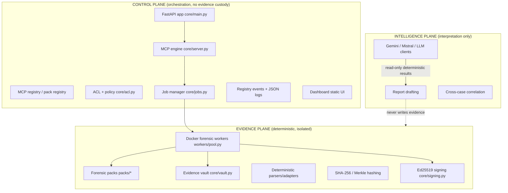

# Architecture

ForenZX MCP Hub is a **three-plane forensic service**. The planes are hard boundaries, not marketing layers: each has its own trust level, its own data, and its own failure behavior.

## Control plane

Everything that orchestrates: the FastAPI application, the MCP endpoint, the remote MCP server registry, the pack registry, ACL/policy enforcement, job lifecycle, audit events, maintenance and the operations dashboard. The control plane **never modifies evidence** and never fabricates forensic results. It holds metadata only.

Key modules: `core/main.py`, `core/server.py`, `core/mcp_registry.py`, `core/pack_registry.py`, `core/acl.py`, `core/jobs.py`, `core/db.py`, `core/maintenance.py`, `core/dashboard/`.

## Evidence plane

Everything deterministic and evidence-custodial: isolated Docker forensic workers, forensic packs, the evidence vault (path-traversal-hardened, Merkle-hashed), deterministic parsers, hashing, and Ed25519 signing of execution records. Evidence-plane output is **reproducible and verifiable**: same input + same pack digest ⇒ same findings, covered by a signed execution record with pre- and post-execution integrity hashes.

Key modules: `workers/pool.py`, `workers/isolation.py`, `packs/base.py`, `packs/*/*`, `core/vault.py`, `core/signing.py`.

## Intelligence plane

Everything interpretive: LLM clients (Gemini/Mistral via remote MCP), report drafting, hypothesis generation and cross-case correlation. **The intelligence plane consumes deterministic evidence-plane results read-only.** An LLM must never create, alter or enrich a forensic finding; its output is always marked `is_ai_assisted` and lives in `AIInterpretation` records that reference findings — it can never replace them.

See [AI_EVIDENCE_BOUNDARY.md](../security/AI_EVIDENCE_BOUNDARY.md) for the full invariant and enforcement points.

## Non-negotiable invariants

1. **Fail-closed.** Missing threat-intel bundle, unverifiable image digest, unknown ACL object, weak production secret ⇒ refuse the operation. Never degrade to "best effort".
2. **AI ≠ EVIDENCE.** Model output is interpretation, never evidence (ADR-0004).
3. **Determinism.** Forensic results come only from digest-pinned containerized tools executed in hardened sandboxes.
4. **No ad-hoc schema.** All database changes go through versioned migrations (`core/migrations.py`, ADR-0002 context).
5. **Control plane ≠ Docker privileged.** The control-plane container never mounts the Docker socket by default (ADR-0003).

## Deployment shape

Single-node, low-maintenance by design (docker-compose, SQLite, one volume). The storage layer (`core/db.py`) is the only place SQL is written, so a future PostgreSQL backend can be added without touching callers. No Kubernetes, no optional infrastructure.
