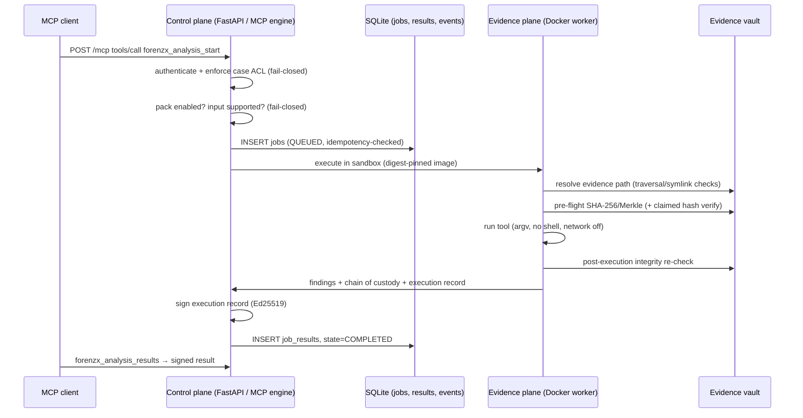

# Data Flow

## 1. Analysis job (happy path)

Failure at any verification point (digest mismatch, hash mismatch, missing IoC bundle) produces a `FAILED`/`SECURITY_BLOCKED` result with classification `ERROR` — never a partial or "best effort" success. A process restart honestly marks active jobs `FAILED / INTERRUPTED_BY_RESTART`.

## 2. Remote MCP management

Admin → `POST/PUT/DELETE /api/v1/mcp-servers` → registry row (secret Fernet-encrypted at rest) → `registry_events` audit row. Health probes (`tools/list`) run in the background and store `last_status/last_latency_ms/last_tools`. Secret values never leave the server; the API exposes only `has_auth_secret`.

## 3. Intelligence plane (read-only)

LLM client → remote MCP over HTTPS → `forenzx_analysis_results` → **deterministic, signed results only**. The model may draft reports/hypotheses stored as `AIInterpretation` (with `finding_refs`, `is_ai_assisted` semantics). No write path from the intelligence plane to evidence or findings exists — see [AI_EVIDENCE_BOUNDARY.md](../security/AI_EVIDENCE_BOUNDARY.md).

## 4. Persistence state

- `DATABASE_PATH` (SQLite, WAL): jobs, job_results, mcp_servers, pack_overrides, registry_events, schema_migrations.
- `DATA_DIR/ed25519-private.pem`: signing key (0600).
- `VAULT_BASE_DIR/<case_id>/<evidence_id>`: immutable evidence.
- `SCRATCH_BASE_DIR/<job_id>`: transient worker scratch, always cleaned up.
- `BACKUPS_DIR`: WAL-consistent snapshots created via the SQLite Online Backup API.

## 5. Trust boundary crossings

Every crossing is listed in [TRUST_BOUNDARIES.md](../security/TRUST_BOUNDARIES.md). The two hardest rules: evidence crosses into a container **read-only**, and model output crosses into storage **only as marked interpretation**.
